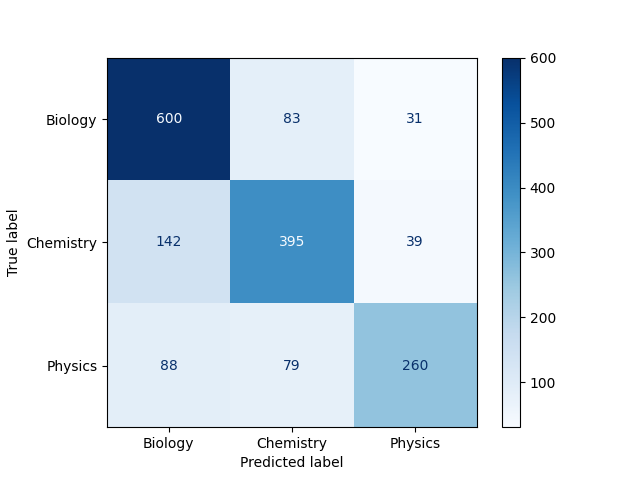

# Naive Bayes Text Classifier

## 📌 Overview
This project implements a text classification system based on the Naive Bayes
algorithm. The goal is to classify textual data into predefined categories using
probabilistic machine learning techniques and a clean, reproducible pipeline.

The project is designed with clarity, modularity, and scientific reproducibility
in mind.

---

## 🎯 Objective
- Build a text classifier using Naive Bayes
- Implement a complete NLP pipeline
- Evaluate model performance using standard metrics
- Provide a clean and reusable project structure

---

## 🧠 Model
The classifier is based on the Naive Bayes algorithm, which applies Bayes' theorem
under the assumption of conditional independence between features.

Depending on the feature representation, the model follows:
- Multinomial Naive Bayes (for word frequency-based features)

Feature extraction methods include:
- Bag of Words (BoW)
- TF-IDF (optional)

---

## ⚙️ Pipeline
The workflow of the project is structured as follows:

1. Text cleaning and normalization
2. Tokenization
3. Feature extraction
4. Model training
5. Model evaluation

Each stage is modularized to allow easy experimentation and extension.

---

## 📁 Project Structure

├───data
│   ├───processed
│   │
│   └───raw_data
│
├───models

├───results
│       classification_report.json
│       confusion_matrix.png
│
└───src
    │   evaluate.py
    │   model.py
    │   preprocessing.py
    │   train.py
    │   __init__.py

## 🛠️ Installation

pip install -r requirements.txt

## Usage

1. Prerocess the data 

python src/preprocessing.py

2. Train the model

python src/train.py

3. Evaluate the model

python src/train.py

## 📊 Evaluation
Model performance is evaluated using standard classification metrics, including
precision, recall, F1-score, and the confusion matrix.

The confusion matrix below is generated automatically during evaluation and saved
in the `results/` directory.

